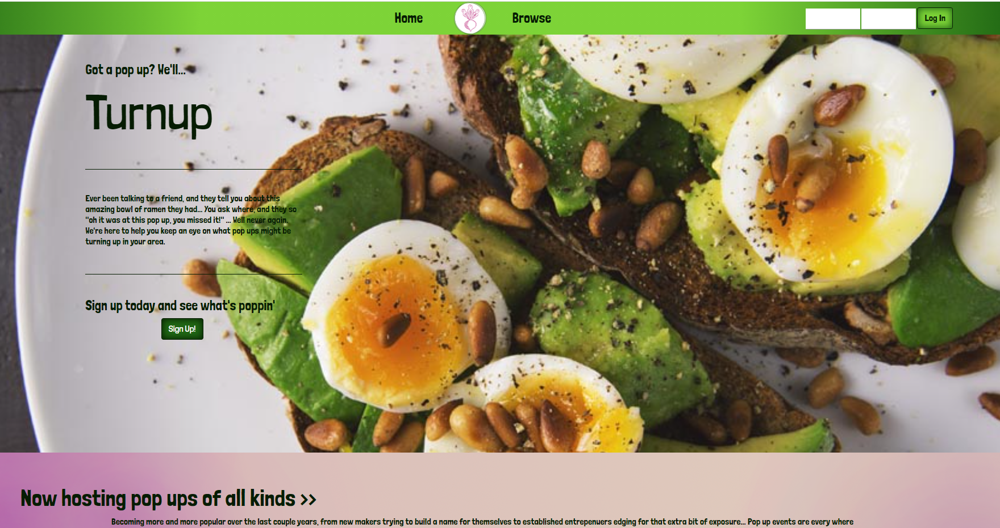

# TurnUp

## Description
TurnUp is a social hub that allows pop-up shop owners and customers alike to be able to signup and host their pop-ups, allow users to view the different pop-ups being hosted, and keep track of the number of people that plan to attend your event.

Vistit hosted site here! https://turnup-12.herokuapp.com/ <a href="https://turnup-12.herokuapp.com/"> https://turnup-12.herokuapp.com/ </a>

## Technologies Used
<ul>
    <li>React JS</li>
    <li>MongoDB</li>
    <li>Mongoose</li>
    <li>Express JS</li>
    <li>Node JS</li>
    <li>Axios</li>
</ul>

## Installation
First, clone the github repository. Then cd into the turnup folder and npm install. Next, run mongod in your terminal and then open a new terminal and run mongo, and then open another terminal and run eventSeed and userSeed to seed the database. Lastly, run npm start to open up the app on https://localhost:3000!

